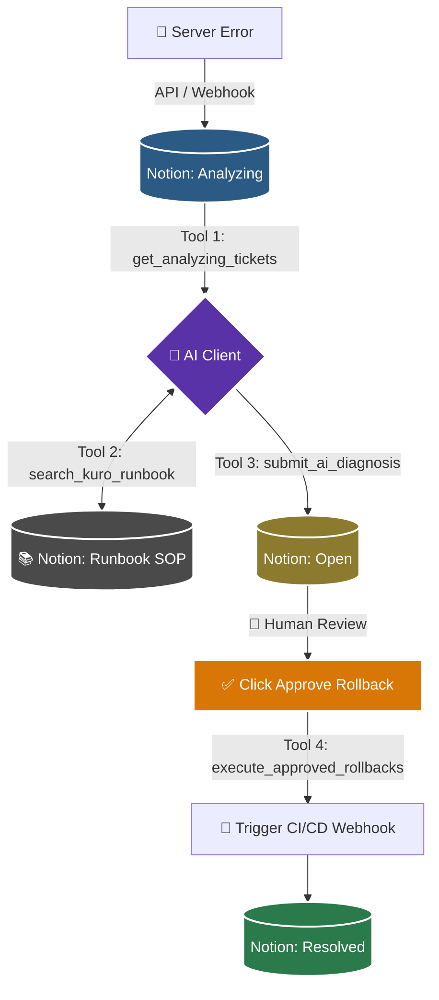

# 🦅 KuroSRE: Autonomous Notion MCP Cockpit

Transform your Notion workspace into an Enterprise-grade Site Reliability Engineering (SRE) Command Center. Built with the **Model Context Protocol (MCP)**, KuroSRE empowers AI Assistants (like Claude or Cursor) to autonomously diagnose server logs, consult internal runbooks (RAG), and execute server rollbacks—all while keeping humans in the loop.


## ✨ The "Wow" Factors

1. **🧠 Zero-Hallucination Diagnosis (RAG):** The AI cannot guess solutions. It is forced to read your official Company SOPs (Runbook Database in Notion) before diagnosing an issue, ensuring 100% compliance with your infrastructure rules.
2. **🛑 Human-in-the-loop (HITL):** Autonomous doesn't mean reckless. The AI writes the diagnosis and confidence score to Notion, but the actual server recovery (Webhook CI/CD) is only triggered when a Human Engineer clicks the `Approve Rollback` checkbox.
3. **📊 Centralized State:** No more switching between Datadog, Slack, and AWS consoles. Everything happens in one aesthetic Notion dashboard.

---

## 🏗️ System Architecture

KuroSRE orchestrates a flawless pipeline between your Server Webhooks, Notion Databases, and your Local AI Client.



---

## 🛠️ MCP Tools Exposed

This server exposes 4 Enterprise-grade tools to your AI Client:

1. `get_analyzing_tickets`: Reads the Notion Database to find newly ingested server errors.
2. `search_kuro_runbook`: Searches the Notion Vector/SOP database for official fixes based on error keywords.
3. `submit_ai_diagnosis`: Writes the AI's technical diagnosis, severity level, and Confidence Score back to the Notion Ticket.
4. `execute_approved_rollbacks`: Sweeps the database for tickets approved by humans and triggers the remote server restart webhook.

---

## 🚀 Installation & Setup

### 1. Prerequisites
- Node.js (v18 or higher)
- A Notion Workspace with API Access.
- An MCP Client (e.g., Claude Desktop, MCP Inspector).

### 2. Clone and Install
```bash
git clone [https://github.com/ArcVielLouvent/kuro-sre-mcp.git](https://github.com/ArvVielLouvent/kuro-sre-mcp.git)
cd kuro-sre-mcp
npm install
```

### 3. Environment Variables
Create a `.env` file in the root directory and add your Notion Integration Key and Database IDs:
```env
NOTION_API_KEY=ntn_your_secret_key_here
NOTION_DB_TICKETS=your_tickets_db_id
NOTION_DB_RUNBOOK=your_runbook_db_id
```

### 4. Running the Server (via MCP Inspector)
```bash
npx @modelcontextprotocol/inspector node server.js
```

---
*Built for the DEV.to x Notion MCP Hackathon 2026.*